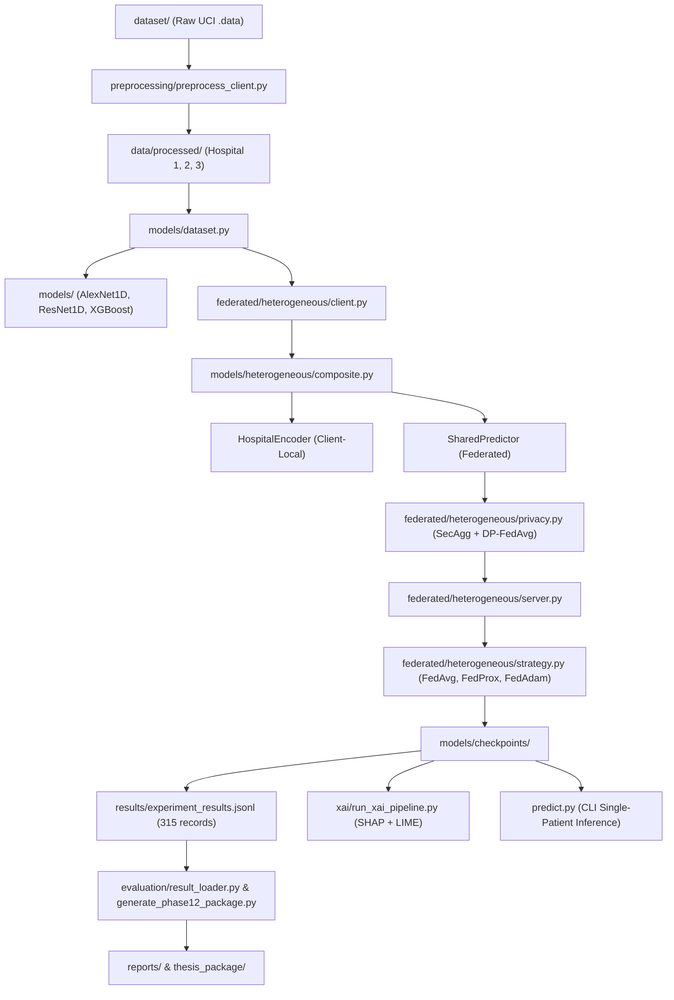

# Codebase Dependency Graph & Component Architecture

**Repository Root:** `.`  
**Generated:** Phase 2 Dependency Mapping  

---

## 1. High-Level Subsystem Flow

---

## 2. Python Module Import Dependencies

| Module | Direct Dependencies (Imports) | Inbound Consumers (Imported By) | CLI Direct Run? |
|---|---|---|:---:|
| `cleanup/generate_phase1_2_reports.py` | `ast` `re` | *none (entry point)* | Yes |
| `evaluation/compare_federated_models.py` | `pathlib` `numpy` `pandas` `matplotlib.pyplot` `seaborn` `torch` | *none (entry point)* | Yes |
| `evaluation/compare_local_models.py` | `pathlib` `numpy` `pandas` `matplotlib.pyplot` `seaborn` `models.config` | *none (entry point)* | Yes |
| `evaluation/eda_analysis.py` | `pathlib` `numpy` `pandas` `matplotlib.pyplot` `seaborn` `scipy` | *none (entry point)* | Yes |
| `evaluation/generate_final_evaluation.py` | `pathlib` `numpy` `pandas` `matplotlib.pyplot` `seaborn` `sklearn.metrics` | *none (entry point)* | Yes |
| `evaluation/generate_phase12_package.py` | `pathlib` `shutil` `numpy` `pandas` `matplotlib` `matplotlib.pyplot` | *none (entry point)* | Yes |
| `evaluation/result_loader.py` | `pathlib` `datetime` `numpy` `pandas` `torch` `sklearn.metrics` | `evaluation/generate_final_evaluation.py` `tests/test_evaluation_integrity.py` `tests/test_xgboost_consistency.py` | Yes |
| `experiments/run_experiment_matrix.py` | `pathlib` `hashlib` `platform` `random` `numpy` `pandas` | *none (entry point)* | Yes |
| `federated/__init__.py` | *standard library only* | *none (entry point)* | No |
| `federated/client.py` | `pathlib` `numpy` `torch` `torch.nn` `torch.optim` `sklearn.metrics` | `federated/simulation.py` `tests/test_fedbn.py` | Yes |
| `federated/config.py` | `pathlib` `torch` | `evaluation/compare_federated_models.py` `federated/client.py` `federated/evaluate_global.py` `federated/evaluate_global_resnet.py` `federated/resnet_client.py` `federated/resnet_server.py` | No |
| `federated/evaluate_global.py` | `pathlib` `numpy` `pandas` `torch` `torch.nn` `sklearn.metrics` | `evaluation/compare_federated_models.py` `federated/simulation.py` | No |
| `federated/evaluate_global_resnet.py` | `pathlib` `numpy` `pandas` `torch` `torch.nn` `sklearn.metrics` | `evaluation/compare_federated_models.py` `federated/resnet_simulation.py` | Yes |
| `federated/heterogeneous/__init__.py` | `federated.heterogeneous.strategy` `federated.heterogeneous.client` `federated.heterogeneous.server` `federated.heterogeneous.evaluate` `federated.heterogeneous.simulation` | *none (entry point)* | No |
| `federated/heterogeneous/client.py` | `pathlib` `numpy` `torch` `torch.nn` `torch.optim` `torch.utils.data` | `experiments/run_experiment_matrix.py` `federated/heterogeneous/__init__.py` `federated/heterogeneous/evaluate.py` `federated/heterogeneous/simulation.py` `tests/test_fedprox_fedopt.py` `tests/test_heterogeneous_fl.py` | No |
| `federated/heterogeneous/config.py` | `pathlib` `torch` | `experiments/run_experiment_matrix.py` `federated/heterogeneous/client.py` `federated/heterogeneous/server.py` `federated/heterogeneous/simulation.py` `results/build_central_results.py` | No |
| `federated/heterogeneous/evaluate.py` | `pathlib` `numpy` `federated.heterogeneous.server` `federated.heterogeneous.client` | `federated/heterogeneous/__init__.py` `federated/heterogeneous/simulation.py` `tests/test_fedprox_fedopt.py` `tests/test_heterogeneous_fl.py` | No |
| `federated/heterogeneous/privacy.py` | `pathlib` `dataclasses` `numpy` | `experiments/run_experiment_matrix.py` `federated/heterogeneous/client.py` `federated/heterogeneous/server.py` `federated/heterogeneous/simulation.py` `federated/heterogeneous/strategy.py` `tests/test_privacy_security.py` | No |
| `federated/heterogeneous/server.py` | `pathlib` `collections` `numpy` `torch` `torch.nn` `models.heterogeneous.predictor` | `experiments/run_experiment_matrix.py` `federated/heterogeneous/__init__.py` `federated/heterogeneous/evaluate.py` `federated/heterogeneous/simulation.py` `tests/test_fedprox_fedopt.py` `tests/test_heterogeneous_fl.py` | No |
| `federated/heterogeneous/simulation.py` | `pathlib` `random` `numpy` `pandas` `torch` `matplotlib` | `experiments/run_experiment_matrix.py` `federated/heterogeneous/__init__.py` `tests/test_privacy_security.py` | Yes |
| `federated/heterogeneous/strategy.py` | `pathlib` `numpy` `federated.utils` `federated.heterogeneous.privacy` `federated.heterogeneous.privacy` | `experiments/run_experiment_matrix.py` `federated/heterogeneous/__init__.py` `federated/heterogeneous/server.py` `federated/heterogeneous/simulation.py` `tests/test_fedprox_fedopt.py` `tests/test_heterogeneous_fl.py` | No |
| `federated/heterogeneous/xai_compat.py` | `pathlib` `numpy` `torch` `torch.nn` `models.heterogeneous.composite` | `tests/test_heterogeneous_fl.py` | No |
| `federated/resnet_client.py` | `pathlib` `numpy` `torch` `torch.nn` `torch.optim` `sklearn.metrics` | `federated/resnet_simulation.py` `tests/test_fedbn.py` | Yes |
| `federated/resnet_server.py` | `pathlib` `numpy` `torch` `torch.nn` `federated.config` `federated.utils` | `federated/evaluate_global_resnet.py` `federated/resnet_simulation.py` `tests/test_fedbn.py` | Yes |
| `federated/resnet_simulation.py` | `pathlib` `numpy` `pandas` `matplotlib.pyplot` `seaborn` `torch` | `experiments/run_experiment_matrix.py` | Yes |
| `federated/server.py` | `pathlib` `numpy` `torch` `torch.nn` `federated.config` `federated.utils` | `federated/simulation.py` `tests/test_fedbn.py` | Yes |
| `federated/simulation.py` | `pathlib` `random` `numpy` `pandas` `torch` `matplotlib.pyplot` | `experiments/run_experiment_matrix.py` `tests/test_fedbn.py` | Yes |
| `federated/strategy.py` | `pathlib` `numpy` `federated.utils` | `federated/resnet_server.py` `federated/resnet_simulation.py` `federated/server.py` `tests/test_fedbn.py` | No |
| `federated/utils.py` | `pathlib` `collections` `numpy` `torch` `torch.nn` `torch.nn.modules.batchnorm` | `evaluation/result_loader.py` `federated/client.py` `federated/evaluate_global.py` `federated/evaluate_global_resnet.py` `federated/heterogeneous/client.py` `federated/heterogeneous/server.py` | No |
| `models/__init__.py` | *standard library only* | *none (entry point)* | No |
| `models/alexnet_1d.py` | `torch` `torch.nn` | `evaluation/compare_federated_models.py` `evaluation/result_loader.py` `experiments/run_experiment_matrix.py` `federated/client.py` `federated/evaluate_global.py` `federated/server.py` | Yes |
| `models/config.py` | `pathlib` `torch` | `evaluation/compare_local_models.py` `evaluation/generate_final_evaluation.py` `evaluation/result_loader.py` `experiments/run_experiment_matrix.py` `models/dataset.py` `models/evaluate_alexnet.py` | No |
| `models/dataset.py` | `pathlib` `numpy` `pandas` `torch` `torch.utils.data` `models.config` | `evaluation/result_loader.py` `experiments/run_experiment_matrix.py` `federated/client.py` `federated/evaluate_global.py` `federated/evaluate_global_resnet.py` `federated/heterogeneous/client.py` | Yes |
| `models/evaluate_alexnet.py` | `pathlib` `numpy` `pandas` `torch` `matplotlib.pyplot` `seaborn` | `evaluation/compare_local_models.py` `federated/simulation.py` | Yes |
| `models/evaluate_resnet.py` | `pathlib` `numpy` `pandas` `torch` `matplotlib.pyplot` `seaborn` | `evaluation/compare_local_models.py` `federated/resnet_simulation.py` | Yes |
| `models/evaluate_xgboost.py` | `pathlib` `numpy` `pandas` `matplotlib.pyplot` `seaborn` `sklearn.metrics` | `evaluation/compare_local_models.py` | Yes |
| `models/heterogeneous/__init__.py` | `models.heterogeneous.encoder` `models.heterogeneous.predictor` `models.heterogeneous.composite` | *none (entry point)* | No |
| `models/heterogeneous/composite.py` | `collections` `numpy` `torch` `torch.nn` `models.heterogeneous.encoder` `models.heterogeneous.predictor` | `experiments/run_experiment_matrix.py` `federated/heterogeneous/client.py` `federated/heterogeneous/xai_compat.py` `models/heterogeneous/__init__.py` `results/build_central_results.py` `tests/test_fedprox_fedopt.py` | No |
| `models/heterogeneous/encoder.py` | `torch` `torch.nn` | `federated/heterogeneous/client.py` `models/heterogeneous/__init__.py` `models/heterogeneous/composite.py` `tests/test_heterogeneous_fl.py` `tests/test_privacy_security.py` | No |
| `models/heterogeneous/predictor.py` | `torch` `torch.nn` | `experiments/run_experiment_matrix.py` `federated/heterogeneous/client.py` `federated/heterogeneous/server.py` `models/heterogeneous/__init__.py` `models/heterogeneous/composite.py` `results/build_central_results.py` | No |
| `models/resnet_1d.py` | `pathlib` `torch` `torch.nn` | `evaluation/compare_federated_models.py` `evaluation/result_loader.py` `experiments/run_experiment_matrix.py` `federated/evaluate_global_resnet.py` `federated/resnet_client.py` `federated/resnet_server.py` | Yes |
| `models/train_alexnet.py` | `pathlib` `numpy` `torch` `torch.nn` `torch.optim` `torch.optim.lr_scheduler` | `experiments/run_experiment_matrix.py` | Yes |
| `models/train_resnet.py` | `pathlib` `numpy` `torch` `torch.nn` `torch.optim` `torch.optim.lr_scheduler` | `experiments/run_experiment_matrix.py` | Yes |
| `models/train_xgboost.py` | `pathlib` `numpy` `pandas` `sklearn.metrics` `models.config` `models.xgboost_model` | `experiments/run_experiment_matrix.py` `models/evaluate_xgboost.py` | Yes |
| `models/xgboost_model.py` | `pathlib` `numpy` `pandas` `xgboost` `xgboost` `models.config` | `evaluation/result_loader.py` `experiments/run_experiment_matrix.py` `models/evaluate_xgboost.py` `models/train_xgboost.py` `results/build_central_results.py` `tests/test_xai_correctness.py` | Yes |
| `predict.py` | `pathlib` `argparse` `numpy` `pandas` `joblib` `preprocessing.feature_schema` | *none (entry point)* | Yes |
| `preprocessing/__init__.py` | *standard library only* | *none (entry point)* | No |
| `preprocessing/analyze_datasets.py` | `pathlib` `pandas` `numpy` | *none (entry point)* | Yes |
| `preprocessing/feature_schema.py` | *standard library only* | `evaluation/eda_analysis.py` `evaluation/generate_final_evaluation.py` `models/evaluate_xgboost.py` `models/train_xgboost.py` `predict.py` `preprocessing/heterogeneous_schema.py` | No |
| `preprocessing/heterogeneous_schema.py` | `dataclasses` `numpy` `pandas` `torch` `preprocessing.feature_schema` | `experiments/run_experiment_matrix.py` `federated/heterogeneous/client.py` `federated/heterogeneous/simulation.py` `results/build_central_results.py` `tests/test_fedprox_fedopt.py` `tests/test_heterogeneous_fl.py` | No |
| `preprocessing/preprocess_client.py` | `pathlib` `numpy` `pandas` `sklearn.model_selection` `sklearn.preprocessing` `joblib` | `evaluation/result_loader.py` `predict.py` `preprocessing/run_preprocessing.py` `xai/model_loader.py` | No |
| `preprocessing/run_preprocessing.py` | `pathlib` `hashlib` `numpy` `pandas` `preprocessing.feature_schema` `preprocessing.preprocess_client` | `evaluation/result_loader.py` | Yes |
| `results/build_central_results.py` | `pathlib` `numpy` `pandas` `torch` `torch.nn` `sklearn.metrics` | *none (entry point)* | Yes |
| `tests/test_evaluation_integrity.py` | `re` `pathlib` `unittest` `numpy` `pandas` `torch` | *none (entry point)* | Yes |
| `tests/test_fedbn.py` | `unittest` `pathlib` `torch` `torch.nn` `numpy` `federated.config` | *none (entry point)* | Yes |
| `tests/test_fedprox_fedopt.py` | `unittest` `pathlib` `torch` `torch.nn` `numpy` `torch.utils.data` | *none (entry point)* | Yes |
| `tests/test_heterogeneous_fl.py` | `unittest` `pathlib` `torch` `torch.nn` `numpy` `torch.utils.data` | *none (entry point)* | Yes |
| `tests/test_privacy_security.py` | `pathlib` `unittest` `numpy` `torch` `models.heterogeneous.encoder` `models.heterogeneous.predictor` | *none (entry point)* | Yes |
| `tests/test_xai_correctness.py` | `pathlib` `unittest` `datetime` `numpy` `pandas` `xai.config` | *none (entry point)* | Yes |
| `tests/test_xgboost_consistency.py` | `pathlib` `unittest` `numpy` `pandas` `preprocessing.feature_schema` `xai.model_loader` | *none (entry point)* | Yes |
| `validate_experiments.py` | `pathlib` `yaml` `re` `pandas` `numpy` | *none (entry point)* | Yes |
| `xai/__init__.py` | *standard library only* | *none (entry point)* | No |
| `xai/compare_lime_shap.py` | `pathlib` `numpy` `pandas` `xai.config` | `xai/run_xai_pipeline.py` | No |
| `xai/config.py` | `platform` `pathlib` `torch` `numpy` `sklearn` `lime` | `evaluation/generate_final_evaluation.py` `tests/test_xai_correctness.py` `xai/compare_lime_shap.py` `xai/lime_explainer.py` `xai/model_loader.py` `xai/run_xai_pipeline.py` | No |
| `xai/lime_explainer.py` | `pathlib` `numpy` `pandas` `matplotlib.pyplot` `lime` `lime.lime_tabular` | `tests/test_xai_correctness.py` `xai/run_xai_pipeline.py` | Yes |
| `xai/model_loader.py` | `pathlib` `numpy` `pandas` `torch` `torch.nn` `xgboost` | `evaluation/result_loader.py` `predict.py` `tests/test_xai_correctness.py` `tests/test_xgboost_consistency.py` `xai/lime_explainer.py` `xai/run_xai_pipeline.py` | Yes |
| `xai/run_xai_pipeline.py` | `pathlib` `datetime` `numpy` `pandas` `matplotlib.pyplot` `seaborn` | `tests/test_xai_correctness.py` | Yes |
| `xai/shap_explainer.py` | `pathlib` `numpy` `pandas` `matplotlib.pyplot` `shap` `xai.config` | `tests/test_xai_correctness.py` `xai/run_xai_pipeline.py` | Yes |
| `xai/shap_xgboost.py` | `pathlib` `numpy` `pandas` `matplotlib.pyplot` `shap` `xai.config` | `tests/test_xai_correctness.py` `tests/test_xgboost_consistency.py` `xai/run_xai_pipeline.py` | Yes |
